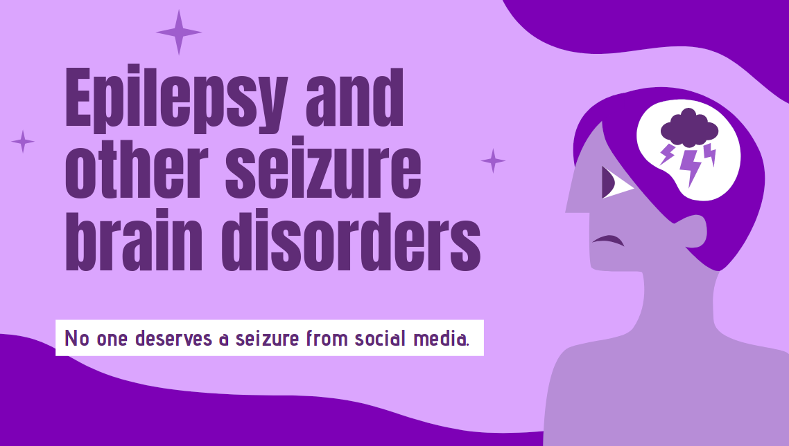

<div align="center"> 
  <p align='center'> 
   
   
   <br>
   
	<br>
</div>
	


## Detect seizure inducing videos using Tensorflow - Background
<hr>

Earlier in March 2017, there was a lot of [news coverage](https://www.nytimes.com/2017/03/17/technology/social-media-attack-that-set-off-a-seizure-leads-to-an-arrest.html) about an incident in the social media. Journalist Kurt Eichenwald received a tweet that stated `"YOU DESERVE A SEIZURE FOR YOUR POSTS"`. The Journalist who suffered from epilepsy, got a seizure by looking at the image.

This incident has shown how social media could potentially be used as a terror weapon to inflict immediate physical pain and suffering to unsuspecting victims. Email, websites with user generated content are equally vulnerable to such attacks. In  2008 a hacker [defaced the website of the Epilepsy Foundation](http://www.cbsnews.com/news/epilepsy-site-hacked-with-seizure-images/) and inserted flashing images which caused multiple health incidents to unsuspecting victims.

It is important for sites with user generated content to acknowledge this and take preventive action. Machine Learning can be applied to automatically detect images causing strobe behavior and block them.
<br><br>
<div align="center">
  </p>
  <p>
  
  <br><br>
  
  </p>
  <br>
 </div>
 
<div align="center"> 
   
  <br><br>
  

</div>

 <div align="center">
 <p>
 <br>
   <br>
   <br><strong>EpilepsyEye.ai</strong> is available under MIT License, read the LICENSE file for more info
  <p>
 </div>
 <br>

<div align="center"> 
   
</div>
  <br>
 
  
<div align="center"> 
   
</div>
  <br>

  ```
  Python 3.7 and above

  Get it from: <https://www.python.org/downloads/>
  ```
<br>
  
<div align="center"> 
   
</div><br>

   ```
   git clone https://github.com/<your-username>/EpilepsyEye.ai.git   
   ```   

   ```
   cd EpilepsyEye.ai
   ```

   ```
   pip install virtualenv
   python -m venv env
   source env/bin/activate
   pip install -r requirements.txt
   ```

   ```
   bash run.sh
   ```
  
<div align="center"> 
   
</div>
  <br>

  ```
  Python

   - OpenCV
   - Tensorflow
   - youtube_dl
   - Streamlit
  ```

  ```
  Technical Details
--
TensorFlow is a an open source library for building machine learning models. In our case we will use an existing model and retrain it to detect seizure inducing images.This is called transfer learning. The popular Inception v3 model trained on [ImageNet](http://image-net.org/) is used as the base model.

1. TensorFlow is installed on docker. the image used is gcr.io/tensorflow/tensorflow:latest-devel
2. Use [Fatkun Batch Image downloader](https://chrome.google.com/webstore/detail/fatkun-batch-download-ima/nnjjahlikiabnchcpehcpkdeckfgnohf?hl=en) for chrome to search and download images of flashing strobe lighting.
3. Follow the instructions in [Google Code Labs](https://codelabs.developers.google.com/codelabs/tensorflow-for-poets) to retrain your model.
  * With 500 Iterations, Final test accuracy was 86.8%
  * With 4000 Iterations, Final test accuracy improved to 91.5% and that is the model uploaded here as [retrained_graph.pb](https://github.com/asasidh/Seizure-Detection-Tensor-Flow/blob/master/retrained_graph.pb)
4. Download test images to validate the trained model. Since I used google images to batch download training images, I decided to use bing image search for the test images. Couple of test images are uploaded under the `test_images` folder.

  ```
  
  <div align="center"> 
   
</div>
  <br>

    
<div align="center"> 
  <table>
<tr align="center">

<td>

Swarnabha Das

<p align="center">

</p>
<p align="center">
<a href = "https://github.com/sd2001"></a>
<a href = "https://www.linkedin.com/in/swarnabha-das-2001official/">

</a>
</p>
</td>
</table>
</tr>
</div>


  
  
<div align="center">
  
 </div>


Technical Details
--
TensorFlow is a an open source library for building machine learning models. In our case we will use an existing model and retrain it to detect seizure inducing images.This is called transfer learning. The popular Inception v3 model trained on [ImageNet](http://image-net.org/) is used as the base model.

1. TensorFlow is installed on docker. the image used is gcr.io/tensorflow/tensorflow:latest-devel
2. Use [Fatkun Batch Image downloader](https://chrome.google.com/webstore/detail/fatkun-batch-download-ima/nnjjahlikiabnchcpehcpkdeckfgnohf?hl=en) for chrome to search and download images of flashing strobe lighting.
3. Follow the instructions in [Google Code Labs](https://codelabs.developers.google.com/codelabs/tensorflow-for-poets) to retrain your model.
  * With 500 Iterations, Final test accuracy was 86.8%
  * With 4000 Iterations, Final test accuracy improved to 91.5% and that is the model uploaded here as [retrained_graph.pb](https://github.com/asasidh/Seizure-Detection-Tensor-Flow/blob/master/retrained_graph.pb)
4. Download test images to validate the trained model. Since I used google images to batch download training images, I decided to use bing image search for the test images. Couple of test images are uploaded under the `test_images` folder.


Notes
----
The animated gif needs to be converted to a jpg image for the  model to work on it. This can be easily accomplished in the command line using [ImageMagick](https://www.imagemagick.org/script/index.php).


Credits
-------
* [Google Code Labs - TensorFlow for Poets](https://codelabs.developers.google.com/codelabs/tensorflow-for-poets)
* [Build a TensorFlow Image Classifier in 5 Min](https://youtu.be/QfNvhPx5Px8)
* [Smashing Security Podcast coverage of tweet incident](http://smashingsecurity.libsyn.com/013-assault-with-a-deadly-tweet)
